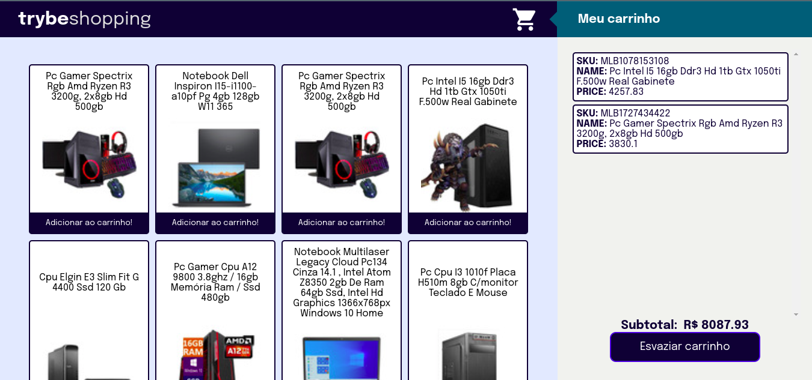

# Project Shopping Cart

Este repositório contém o projeto Shopping Cart desenvolvido por [Raquel G. C Würzler](https://www.linkedin.com/in/raquel-c-wurzler/) enquanto estudava na [Trybe](https://www.betrybe.com/) no módulo de FrontEnd :rocket:

_"A Trybe é uma escola do futuro para qualquer pessoa que queira melhorar de vida e construir uma carreira de sucesso em tecnologia, onde a pessoa paga quando conseguir um bom trabalho."_

#### Projeto de conclusão da seção 5, no módulo de Front-end

### Principal objetivo:
* Um site de compras, onde é possível ver os detalhes dos produtos, adicionar ao carrinho de compras e verificar o valor total.

### O que foi entregue:
<details>
  <summary>🤓</summary>
  
  <br />
  
</details>

### Detalhes desse projeto:
* Projeto feito com JavaScript, HTML, CSS;
* As informações referentes aos produtos vem da API do Mercado Livre que disponibiliza informações de vários produtos, pesquisando no endpoint de computadores;
* Nessa aplicação é possível visualizar detalhes de vários computadores (nome e imagem do produto), adicionar o produto no carrinho de compras, visualizar cada produto no carrinho de compras e a soma dos valores, esvaziar o carrinho de compras;


##### Arquivos disponibilizados pela Trybe:
* pasta helpers;
* pasta mocks;
* .eslintignore;
* .eslintrc.json;
* .gitignore;
* .stylelintrc.json;
* cypress.json;
* package-lock.json;
* package.json;
* reporter.json;

##### Link Deploy: https://prismatic-torte-a6b0b1.netlify.app/

## Stack utilizada

**Front-end:** JavaScript, CSS, HTML

## Instalação e uso

```bash
# Abra um terminal e copie este repositório com o comando
git clone git@github.com:Raquel-Wurzler/project_shopping_cart.git

# Entre na pasta do projeto 
cd project_shopping_cart

# Instale as dependências
yarn install
ou 
npm install

# Rode o servidor
no VSCode, com a extensão LiveServer

```
